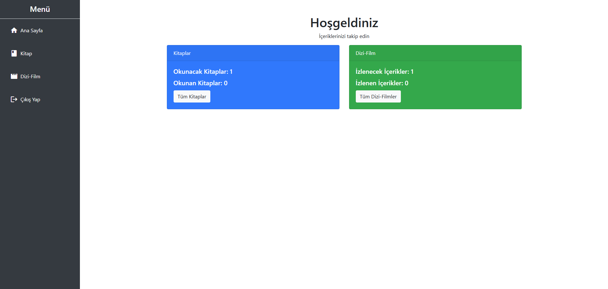

# Okuma Ve İzleme Takip Sistemi

## Ekip Listesi
- İsmail Çakıcı - 132030066
- Süleyman Yıldırım - 132030043

## Proje Hakkında
Okuma ve İzleme Takip Sistemi, kullanıcıların okudukları kitapları ve izledikleri dizi/filmleri takip etmelerine olanak sağlayan ASP.NET MVC tabanlı bir web uygulamasıdır. Uygulama, kullanıcıların içerik eklemesine, içerik durumlarını güncellemesine ve kişisel içerik listelerini yönetmesine olanak tanır.

## Özellikler
- Kullanıcı Yönetimi: Kullanıcı kayıt olma, giriş yapma ve çıkış yapma işlemleri.
- İçerik Takibi: Kitaplar ve dizi/filmler için "Okunacak/İzlenecek" ve "Okundu/İzlendi" listelerinin yönetimi.
- CRUD İşlemleri: İçerik ekleme, görüntüleme ve durum güncelleme.
- Veri Güvenliği: Şifrelerin güvenli bir şekilde saklanması (hash'lenmesi).

## Kullanılan Teknolojiler
- ASP.NET Core MVC: Uygulama geliştirme.
- Entity Framework Core: Veritabanı işlemleri.
- Microsoft SQL Server: Veritabanı yönetimi.
- Bootstrap: Kullanıcı arayüzü tasarımı.

## Proje Yapısı

- Models:

  - IcerikModel: İçerikler için model.
  - KullaniciModel: Kullanıcılar için model.

- Controllers:

  - KitaplarController: Kitap içeriklerini yönetir.
  - DiziFilmController: Dizi/film içeriklerini yönetir.
  - KullaniciController: Kullanıcı işlemlerini yönetir.

- Views:

  - Kitaplar/Index.cshtml: Kitap içeriklerinin görüntülenmesi ve yönetimi.
  - DiziFilm/Index.cshtml: Dizi/film içeriklerinin görüntülenmesi ve yönetimi.
  - Kullanici/KayitOl.cshtml ve Kullanici/GirisYap.cshtml: Kullanıcı kayıt ve giriş ekranları.

## Tanıtım Videosu
https://github.com/user-attachments/assets/f9db3e7c-2e8c-4c45-9986-865d1b5289c2

## Ekran Görüntüleri

| Görsel                | Açıklama                      |
|-----------------------|-------------------------------|
|  | Giriş Yap Sayfası              |
|  | Kayıt Ol Sayfası               |
|  | Ana Sayfa                      |
|  | Tüm Kitaplar Sayfası           |
|  | Kitap Ekleme Sayfası           |
|  | Tüm Dizi/Film Sayfası          |
|  | Dizi/Film Ekleme Sayfası      |
|  | Veritabanı İçerik Tablosu         |
|  | Veritabanı Kullanıcı Tablosu      |

